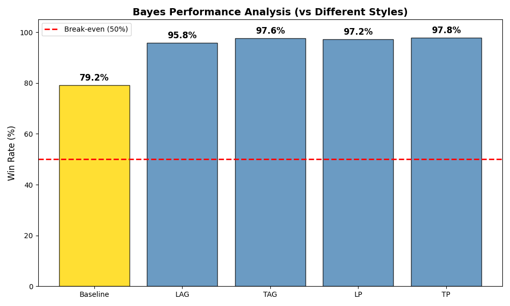

# 贝叶斯德州扑克智能体 

    <a href="./README.md">English</a> | <b>简体中文</b>

本项目实现了一个用于单挑无限注德州扑克的高级**贝叶斯推理智能体**。该智能体旨在通过动态对手建模，解决不完美信息博弈中的决策难题。

与通常需要数百万局训练才能收敛的“黑盒”深度强化学习方法不同，**贝叶斯智能体**利用概率图模型实时更新对对手手牌范围的信念分布。这种机制使其能够在极短的对局数内识别对手风格，并迅速调整策略进行针对性剥削。

为了全面评估智能体的性能，我们构建了一个包含五种典型对手的竞技场：

* **Baseline Agent (基准智能体):** 一个基于启发式规则和蒙特卡洛胜率计算（Monte Carlo Equity）的强力对手，模拟稳健的“ABC Poker”打法。
* **Deep RL Agents (深度强化学习智能体):** 基于 DQN 算法，并通过奖励塑形专门训练出的四种典型人类风格：
    * **LAG (松凶):** 入池范围宽，下注频率高，极具压迫感。
    * **TAG (紧凶):** 起手牌选择严格，但入池后打法强硬。
    * **LP (松弱):** 典型的“跟注站”，喜欢入池看牌但极少加注。
    * **TP (紧弱):** 风格保守的“岩石”，只玩绝对强牌且倾向于控池。

### 评测结果

在包含 2,500 手牌的深筹码（Deep Stack）锦标赛测试中（每组对决 500 场），贝叶斯智能体展现了全面的统治力：不仅以 **>94% 的胜率** 碾压了所有风格化 RL 对手，更以 **74.6% 的胜率** 击败了代表理性计算的 Baseline Agent。

*(图：贝叶斯智能体对抗不同风格对手的胜率统计)*

